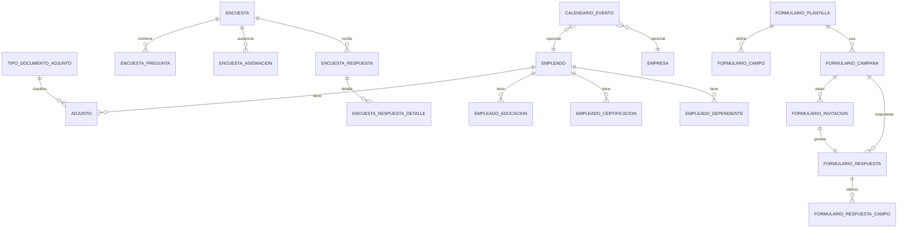

# Módulo Gestión Humana — Fase 1

## Resumen

Módulo unificado **Gestión Humana** (ID 9) con encuestas, calendario RRHH, formularios compartidos de actualización de datos y gestión transversal de adjuntos.

## Diagrama ER (Fase 1)

## Permisos (módulo 9)

| ID | Código | Uso |
|----|--------|-----|
| 34 | GESTION_HUMANA_VIEW | Menú + lectura |
| 35 | GESTION_HUMANA_CREATE | Crear encuestas, eventos, campañas, adjuntos |
| 36 | GESTION_HUMANA_UPDATE | Publicar encuestas, aprobar formularios |
| 37 | GESTION_HUMANA_DELETE | Inactivar registros |

SuperAdmin recibe permisos vía `UsuarioSeeder` y migración `2026_08_07_000002`.

## Menú (AuthController)

- `/calendario` — Calendario
- `/encuestas` — Encuestas
- `/formularios-empleado` — Formularios / actualización
- `/documentos-empleado` — Documentos adjuntos

## API REST

### Público (sin Sanctum)

| Método | Ruta | Descripción |
|--------|------|-------------|
| GET | `/api/formularios/responder/{token}` | Carga formulario por token |
| POST | `/api/formularios/responder/{token}` | Envía respuesta empleado |
| POST | `/api/formularios/responder/{token}/adjunto` | Sube archivo en formulario público |

### Protegido (`auth:sanctum` + `GESTION_HUMANA_*`)

Ver `routes/api.php` sección Gestión Humana.

## Flujo formularios compartidos

1. RRHH crea **plantilla** con campos mapeados (`EMPLEADO`, `EMPLEADO_EDUCACION`, etc.).
2. Crea **campaña** (ej. "Actualización fin de año 2026") y la **activa**.
3. Genera **invitaciones** → URL `/actualizar-datos/{token}`.
4. Empleado completa sin login admin; adjuntos vía `FileUpload`.
5. Respuesta queda en `pendiente_aprobacion`.
6. RRHH **aprueba** → `FormularioAprobacionService` aplica cambios al expediente.

## Calendario

- FullCalendar Vue 3 v6 (`@fullcalendar/vue3` + plugins).
- Eventos manuales CRUD.
- Eventos automáticos al publicar encuesta o activar campaña (`CalendarioEventoService::syncFromOrigen`).

## Adjuntos

- Disco Laravel `local` (descarga autenticada vía controller).
- Validación: PDF/JPG/PNG/DOCX, máx. 10 MB.
- Catálogo `TIPO_DOCUMENTO_ADJUNTO` seedeado en migración.

## Recordatorios encuesta

Flag `ENVIAR_RECORDATORIOS`: al publicar, se encola `EnviarRecordatoriosEncuestaJob` (cola `database`) y se envía `EncuestaRecordatorioMail` a empleados de la audiencia sin respuesta. Si el mailer falla o no está configurado, se registra warning y no se interrumpe la publicación (`MAIL_MAILER=log` por defecto).

## Encuestas confidenciales (`ANONIMA = true`)

Modelo **confidencial, no anónimo total**:

| Aspecto | Comportamiento |
|---------|----------------|
| Reporte RRHH | Solo agregados: conteos, porcentajes, participación. Sin nombre de empleado por respuesta. |
| Control duplicados | El sistema guarda `ID_EMPLEADO` en `ENCUESTA_RESPUESTA` para impedir responder dos veces. |
| Participación | Métrica `respondieron / asignados` visible en resultados. |
| Empleado | Ve aviso de confidencialidad al responder; sabe que su identidad no aparece en el reporte. |

Campo BD: `ENCUESTA.ANONIMA` (nombre legacy; en UI se etiqueta **Confidencial**).

## Migraciones

- `2026_08_07_000001_create_gestion_humana_tables.php`
- `2026_08_07_000002_add_gestion_humana_permissions.php`

Ejecutar: `php artisan migrate`

## Frontend

| Vista | Ruta |
|-------|------|
| Calendario/Index.vue | `/calendario` |
| Encuestas/Index.vue | `/encuestas` |
| FormulariosEmpleado/Index.vue | `/formularios-empleado` |
| FormulariosEmpleado/Responder.vue | `/actualizar-datos/:token` (público) |
| DocumentosEmpleado/Index.vue | `/documentos-empleado` |
| components/FileUpload.vue | Reutilizable drag & drop |

## Fases posteriores

- **Fase 2:** Vacaciones/permisos, capacitaciones ✅
- **Fase 3:** Reclutamiento, evaluación desempeño, UI actividades MH ✅

---

# Fase 2 — Vacaciones/permisos y Capacitaciones

## Tablas nuevas

| Tabla | Propósito |
|-------|-----------|
| `TIPO_PERMISO_LABORAL` | Catálogo: vacaciones, permiso personal, médico, duelo, maternidad |
| `EMPLEADO_SALDO_VACACIONES` | Saldo anual por empleado (15 días estándar, prorrateo por ingreso) |
| `SOLICITUD_PERMISO` | Solicitudes con flujo pendiente → aprobada/rechazada |
| `CAPACITACION` | Cursos con modalidad, cupo, fechas |
| `CAPACITACION_INSCRIPCION` | Inscripción por empleado + certificado adjunto |
| `CAPACITACION_ASISTENCIA` | Registro diario de asistencia |

Migración: `2026_08_07_100000_create_vacaciones_capacitaciones_tables.php`

## API REST (GESTION_HUMANA_*)

### Permisos / vacaciones

| Método | Ruta | Acción |
|--------|------|--------|
| GET | `/api/permisos/catalogs` | Tipos de permiso |
| GET | `/api/permisos` | Listado (filtro `estado`, `ID_EMPLEADO`) |
| GET | `/api/permisos/pendientes` | Bandeja pendientes |
| GET | `/api/permisos/saldo/{idEmpleado}` | Saldo vacaciones |
| POST | `/api/permisos` | Nueva solicitud |
| POST | `/api/permisos/saldos/inicializar` | Seed saldos año |
| POST | `/api/permisos/{id}/aprobar` | Aprueba + calendario + descuenta saldo |
| POST | `/api/permisos/{id}/rechazar` | Rechaza con motivo |
| POST | `/api/permisos/{id}/cancelar` | Cancela pendiente |

### Capacitaciones

| Método | Ruta | Acción |
|--------|------|--------|
| GET/POST | `/api/capacitaciones` | CRUD list/create |
| GET/PUT/DELETE | `/api/capacitaciones/{id}` | Ver/editar/inactivar |
| POST | `/api/capacitaciones/{id}/publicar` | Publica + evento calendario |
| POST | `/api/capacitaciones/{id}/inscribir` | Inscribe empleados |
| POST | `/api/capacitaciones/inscripciones/{id}/asistencia` | Marca asistencia |
| POST | `/api/capacitaciones/inscripciones/{id}/completar` | Completa + calificación/certificado |

## Frontend Fase 2

| Vista | Ruta |
|-------|------|
| VacacionesPermisos/Index.vue | `/vacaciones-permisos` |
| Capacitaciones/Index.vue | `/capacitaciones` |

## Integración planilla "Vacaciones"

Al **aprobar** una solicitud de tipo vacaciones (`DESCUENTA_SALDO_VACACIONES = true`):

1. `VacacionesPlanillaService` crea o reutiliza periodo y planilla tipo **Vacaciones**.
2. Calcula la línea del empleado con los **días solicitados** como días trabajados.
3. Marca `INTEGRADO_PLANILLA = true` e `ID_PLANILLA` en la solicitud.

Reintento manual: `POST /api/permisos/{id}/integrar-planilla`

Migración: `2026_08_07_300000_add_planilla_to_solicitud_permiso.php`

## Decisiones Fase 2

1. **Saldo 15 días/año** con prorrateo si ingresa en el mismo año — regla simplificada LSS El Salvador.
2. **Solo tipo VACACIONES descuenta saldo** (`DESCUENTA_SALDO_VACACIONES`).
3. **Calendario** sincroniza permisos aprobados y capacitaciones publicadas.
4. **Certificados** vía `ID_ADJUNTO_CERTIFICADO` reutilizando módulo adjuntos (`ORIGEN=capacitacion`).

## Decisiones de diseño

1. **Permisos únicos** `GESTION_HUMANA_*` en lugar de subdividir por sub-módulo — simplifica RBAC inicial; se puede granularizar en Fase 2.
2. **Adjuntos en disco `local`** — documentos sensibles no expuestos en URL pública; descarga vía API autenticada.
3. **Tablas hijas empleado** (`EMPLEADO_EDUCACION`, `EMPLEADO_CERTIFICACION`, `EMPLEADO_DEPENDIENTE`) — no existían; creadas para mapeo de formularios con flujo de aprobación.
4. **Token formulario** — 48 chars aleatorios en `FORMULARIO_INVITACION.TOKEN`; sin Sanctum en ruta pública.
5. **Calendario** — sincronización por `ORIGEN_TIPO` + `ORIGEN_ID` evita duplicar eventos al republicar.

---

# Fase 3 — Reclutamiento, evaluación de desempeño y actividades MH

## Tablas nuevas

| Tabla | Propósito |
|-------|-----------|
| `ETAPA_RECLUTAMIENTO` | Pipeline: Recepción CV → Contratado (seed) |
| `VACANTE` | Puestos abiertos con empresa, departamento, cargo |
| `CANDIDATO` | Postulantes por vacante con etapa actual |
| `CANDIDATO_ENTREVISTA` | Entrevistas programadas (sync calendario) |
| `EVALUACION_PERIODO` | Periodos anuales/semestrales |
| `EVALUACION_DESEMPENO` | Asignación evaluado ↔ evaluador |
| `EVALUACION_META` | Metas/KPIs por evaluación |

Migración: `2026_08_07_200000_create_reclutamiento_evaluacion_tables.php`

`ACTIVIDAD_ECONOMICA` ya existía (seed `CatalogSeeder`); Fase 3 expone CRUD vía API.

## API REST (GESTION_HUMANA_*)

### Reclutamiento

| Método | Ruta | Acción |
|--------|------|--------|
| GET | `/api/reclutamiento/catalogs` | Etapas del pipeline |
| GET/POST | `/api/reclutamiento/vacantes` | Listado / crear vacante |
| GET/PUT/DELETE | `/api/reclutamiento/vacantes/{id}` | Detalle / editar / inactivar |
| POST | `/api/reclutamiento/vacantes/{id}/cerrar` | Cierra vacante |
| POST | `/api/reclutamiento/candidatos` | Registra candidato |
| POST | `/api/reclutamiento/candidatos/{id}/etapa` | Avanza etapa |
| PUT | `/api/reclutamiento/candidatos/{id}/cv` | Vincula CV (`ID_ADJUNTO_CV`) |
| POST | `/api/reclutamiento/entrevistas` | Programa entrevista + calendario |

### Evaluación de desempeño

| Método | Ruta | Acción |
|--------|------|--------|
| GET/POST | `/api/evaluaciones/periodos` | Periodos |
| GET | `/api/evaluaciones/periodos/{id}` | Detalle + resultados agregados |
| POST | `/api/evaluaciones/periodos/{id}/activar` | Activa periodo |
| POST | `/api/evaluaciones/periodos/{id}/asignar` | Asigna evaluaciones |
| GET | `/api/evaluaciones/{id}` | Evaluación + metas |
| PUT | `/api/evaluaciones/{id}/metas` | Guarda metas |
| POST | `/api/evaluaciones/{id}/completar` | Completa evaluación |

### Actividades económicas MH

| Método | Ruta | Acción |
|--------|------|--------|
| GET/POST | `/api/actividades-economicas` | Listado / crear |
| PUT/DELETE | `/api/actividades-economicas/{id}` | Editar / inactivar |

## Frontend Fase 3

| Vista | Ruta |
|-------|------|
| Reclutamiento/Index.vue | `/reclutamiento` |
| Evaluaciones/Index.vue | `/evaluaciones` |
| ActividadesEconomicas/Index.vue | `/actividades-economicas` |

## Menú adicional

- `/reclutamiento` — Reclutamiento y selección
- `/evaluaciones` — Evaluación de desempeño
- `/actividades-economicas` — Catálogo CIIU MH

## Integración calendario

- Entrevistas: `origen_tipo = entrevista` → enlace `/reclutamiento`
- Permisos y capacitaciones (Fase 2) sin cambios

## Decisiones Fase 3

1. **Pipeline reclutamiento** con etapas seed fijas; contratación marca `CANDIDATO.ESTADO = contratado`.
2. **Evaluación** por periodo con metas ponderadas; puntuación global calculada al completar.
3. **Actividades MH** reutilizan tabla existente; solo mantenimiento CRUD, no re-seed.

## Adjuntos en reclutamiento (CV)

Al registrar un candidato se puede adjuntar currículum con `FileUpload`:

1. Se crea el candidato (`POST /api/reclutamiento/candidatos`).
2. Si hay archivo, se sube vía `POST /api/adjuntos` con `ORIGEN=reclutamiento`, `ID_ORIGEN=ID_CANDIDATO`, tipo `OTRO` (ID 6).
3. Se vincula con `PUT /api/reclutamiento/candidatos/{id}/cv` → campo `CANDIDATO.ID_ADJUNTO_CV`.
4. Descarga autenticada desde la tabla de candidatos (`GET /api/adjuntos/{id}/download`).

Los CV también aparecen en **Documentos del empleado** filtrando origen `reclutamiento` (sin `ID_EMPLEADO` hasta contratación).

---

# Fase E — Cumplimiento legal El Salvador

Siete reportes/exportaciones de cumplimiento patronal, todos bajo el grupo de menú **Cumplimiento SV** (permiso `SALARIAL_VIEW`), construidos sobre las planillas ya calculadas y cerradas — no se re-implementa la lógica de cálculo, solo se consolida y exporta.

## Tabla nueva

| Tabla | Propósito |
|-------|-----------|
| `ISSS_MOVIMIENTO` | Bitácora de altas/bajas de afiliación ISSS (`TIPO`, `FECHA`, `ESTADO`, `DATOS_JSON`) |

Migración: `2026_08_10_000002_create_isss_movimiento_table.php`

## Servicios y decisiones de negocio

| Módulo | Servicio | Decisión |
|--------|----------|----------|
| E.1 Planilla ISSS | `IsssPlanillaService` | El ISSS no publica layout XML/API; se exporta un **CSV/TXT delimitado por `;`, UTF-8 con BOM**, apto para transcribir al portal patronal. Recalcula el salario cotizable con `PayrollMonthlyCeilingService` (techo $1,000, 3% laboral / 7.5% patronal). |
| E.2 Planilla AFP | `AfpPlanillaService` | Cada AFP (CRECER, CONFÍA, etc.) recibe su propio archivo → se genera **un CSV por AFP** seleccionada, además de un catálogo con totales por AFP para elegir cuál(es) descargar. |
| E.3 F-14 / Renta retenida MH | `RentaRetencionService` | El MH no documenta públicamente el XML del F-14; se genera un **acumulado anual por empleado (CSV)** como insumo de la declaración, más un **PDF resumen** (no oficial) vía `resources/views/reportes/renta-anual.blade.php`. |
| E.4 INSAFORP | `InsaforpService` | Reutiliza `PayrollMonthlyCeilingService::empresaAplicaInsaforp()` (>10 empleados) y el 1% patronal ya calculado y almacenado en `DETALLE_PLANILLA.INSAFORP_PATRONAL` (techo $1,000). |
| E.5 Altas y bajas ISSS | `IsssMovimientoService` | Sin API pública de afiliación: se lleva una bitácora `pendiente → enviado` que RRHH exporta y marca manualmente tras transcribir al portal patronal. |
| E.6 Aguinaldo (corrida) | `AguinaldoCorridaService` | Solo previsualiza/exporta y crea el **encabezado** de la planilla tipo "Aguinaldo" (`TIPO_PLANILLA` = 3); el detalle se calcula con el flujo estándar `POST /api/planillas/{id}/calcular` para no duplicar `PayrollCalculatorService::calculateAguinaldoLine()`. |
| E.7 Retención 10% servicios profesionales | `Retencion10Service` | La planilla ya retiene el 10% vía `TIPO_CONTRATACION.APLICA_RENTA_FIJA` + `PORCENTAJE_RENTA_FIJA` (Art. 156 Código Tributario); este servicio solo consolida/exporta lo ya calculado en `DETALLE_PLANILLA.RENTA_EMPLEADO`, o una **estimación** con el salario vigente cuando aún no hay planilla cerrada. |

Traits compartidos (`app/Services/Concerns/`): `BuildsDelimitedFile` (CSV con BOM/CRLF/escape) y `ListsClosedPlanillas` (planillas `CERRADA=true`, `ANULADA=false`).

## API REST (`SALARIAL_VIEW` lectura/exportación, `SALARIAL_CREATE`/`SALARIAL_UPDATE` para mutaciones)

| Método | Ruta | Acción |
|--------|------|--------|
| GET | `/api/cumplimiento/isss/planillas` | Planillas cerradas para select |
| GET | `/api/cumplimiento/isss/preview` | Vista previa cotizaciones ISSS |
| GET | `/api/cumplimiento/isss/export` | Descarga CSV ISSS |
| GET | `/api/cumplimiento/afp/planillas` | Planillas cerradas para select |
| GET | `/api/cumplimiento/afp/catalogo` | Totales por AFP de la planilla |
| GET | `/api/cumplimiento/afp/preview` | Vista previa cotizaciones AFP (por AFP o todas) |
| GET | `/api/cumplimiento/afp/export` | Descarga CSV AFP (por AFP o todas) |
| GET | `/api/cumplimiento/insaforp/planillas` | Planillas cerradas para select |
| GET | `/api/cumplimiento/insaforp/preview` | Vista previa INSAFORP |
| GET | `/api/cumplimiento/insaforp/export` | Descarga CSV INSAFORP |
| GET | `/api/cumplimiento/renta/preview` | Acumulado anual renta retenida |
| GET | `/api/cumplimiento/renta/export` | Descarga CSV F-14 |
| GET | `/reportes/cumplimiento/renta/pdf` | PDF resumen F-14 (auth por token, como otros reportes) |
| GET | `/api/cumplimiento/isss-movimientos` | Lista movimientos (filtros `tipo`, `estado`) |
| POST | `/api/cumplimiento/isss-movimientos/marcar-enviado` | Marca movimientos como enviados |
| GET | `/api/cumplimiento/isss-movimientos/export` | Descarga CSV movimientos |
| GET | `/api/cumplimiento/aguinaldo/preview` | Previsualiza aguinaldo por empresa/fecha de corte |
| GET | `/api/cumplimiento/aguinaldo/export` | Descarga CSV aguinaldo |
| POST | `/api/cumplimiento/aguinaldo/crear-planilla` | Crea encabezado de planilla tipo Aguinaldo |
| GET | `/api/cumplimiento/retencion10/planillas` | Planillas cerradas con retención 10% para select |
| GET | `/api/cumplimiento/retencion10/estimacion` | Estimación con salario vigente (sin planilla) |
| GET | `/api/cumplimiento/retencion10/preview` | Vista previa desde planilla cerrada |
| GET | `/api/cumplimiento/retencion10/export` | Descarga CSV (planilla o estimado) |

## Frontend

| Vista | Ruta |
|-------|------|
| Cumplimiento/Isss.vue | `/cumplimiento/isss` |
| Cumplimiento/Afp.vue | `/cumplimiento/afp` |
| Cumplimiento/Insaforp.vue | `/cumplimiento/insaforp` |
| Cumplimiento/Renta.vue | `/cumplimiento/renta` |
| Cumplimiento/IsssMovimientos.vue | `/cumplimiento/isss-movimientos` |
| Cumplimiento/Aguinaldo.vue | `/aguinaldo` |
| Cumplimiento/Retencion10.vue | `/cumplimiento/retencion10` |

## Ganchos automáticos de altas/bajas ISSS

- `EmpleadoController::store` → `IsssMovimientoService::registrarAlta()` al crear un empleado con tipo de contratación que aplica ISSS.
- `EmpleadoController::destroy` y `LiquidacionController::store` → `IsssMovimientoService::registrarBaja()` al inactivar/liquidar un empleado.
- Ambos son *no-op* silencioso si el tipo de contratación no aplica ISSS o ya existe un movimiento del mismo tipo creado el mismo día (evita duplicados).

## Catálogo compartido

`CatalogSelectController` agrega el tipo `planillas-cerradas` (planillas con `CERRADA=true`, `ANULADA=false`, filtrable por `ID_EMPRESA`) reutilizado por los siete selectores de planilla del módulo.

---

## Mejoras opcionales (futuro)

| Ítem | Estado | Notas |
|------|--------|-------|
| CV en reclutamiento | ✅ Implementado | `FileUpload` + `ID_ADJUNTO_CV` |
| Certificado en capacitaciones | ✅ Implementado | Modal completar + `FileUpload` → `ID_ADJUNTO_CERTIFICADO` |
| Integración planilla vacaciones | ✅ Implementado | Auto al aprobar + integrar-planilla |
| Recordatorios encuesta por email | ✅ Implementado | Job + Mailable; requiere `MAIL_*` / cola |
| Onboarding contratar candidato | ✅ Implementado | `POST /reclutamiento/candidatos/{id}/contratar` crea `EMPLEADO` |
